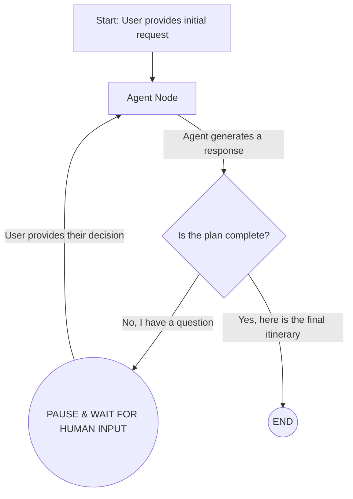

# LangGraph Interactive AI Travel Agent


This project demonstrates a stateful, interactive AI agent built with LangGraph that acts as a travel planner. The agent showcases the "human-in-the-loop" pattern by pausing its work to ask the user for decisions before proceeding, all managed through a simple web interface built with Streamlit.

### Live Demo
*(It is highly recommended to create a short GIF or MP4 demo showing the web UI in action and add it here.)*


---

## Detailed Architecture: The Interrupt-Driven Flow

The agent's logic is defined as a stateful graph that can be paused and resumed. The core of the application is a main agent node that runs its own tool-using loop. A router then inspects the agent's output and decides whether to continue, end the process, or **interrupt** the flow to wait for human input.

The graph's state is persisted between user interactions using a checkpointer, giving the agent a continuous memory for a single conversation.



 
## Key Concepts Demonstrated
*   **Human-in-the-Loop:** The agent uses LangGraph's interrupt and checkpointing features to pause execution and wait for user feedback, creating a collaborative workflow.
*   **Stateful Conversations:** A `MemorySaver` checkpointer, persisted in Streamlit's session state, allows the graph to maintain a continuous memory across multiple user interactions.
*   **UI Integration:** The agent's core logic (`agent.py`) is cleanly decoupled from the user interface (`app.py`), which is a best practice for application design.
*   **Robust Agent Behavior:** The agent is driven by a strict, process-oriented system prompt that minimizes hallucinations and enforces a step-by-step workflow (Clarify -> Flights -> Hotels -> Activities -> Final Plan).

## Tech Stack
*   **Framework:** LangGraph, LangChain
*   **UI:** Streamlit
*   **LLM Provider:** Groq
*   **LLM:** Llama 3.1 8B (`llama-3.1-8b-instant`)
*   **Tools:** Tavily Search API
*   **Environment Management:** Python venv, python-dotenv

## Setup and Usage

1.  **Clone the repository:**
    ```bash
    git clone https://github.com/ananya101001/langgraph-interactive-agent.git
    cd langgraph-interactive-agent
    ```

2.  **Create a virtual environment and install dependencies:**
    ```bash
    python -m venv venv
    source venv/bin/activate  # On Windows: venv\Scripts\activate
    pip install -r requirements.txt
    ```

3.  **Set up your API keys:**
    *   Create a file named `.env` in the root directory. This file is ignored by Git and will not be uploaded.
    *   Add your API keys to it:
    ```
    GROQ_API_KEY="gsk_..."
    TAVILY_API_KEY="tvly-..."
    ```

4.  **Run the application:**
    ```bash
    streamlit run app.py
    ```
    Your browser will open to the chat interface automatically.
